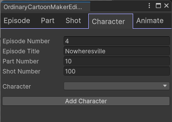

# Ordinary Cartoon Maker

This repository holds code for a Unity Editor Window for use with the
[Unity Sequences](https://docs.unity3d.com/Packages/com.unity.sequences@2.1/manual/index.html)
package. This is a tool I use to create a cartoon series on YouTube,
designed for my personal specific needs. If you don't like the way I have set
up my projects, you may still find this package useful as sample code for
creating your own helper tools for manipulating Sequences, Timelines,
Animation Tracks, etc. It uses UI Toolkit for the UI.

I use Unity as a rendering engine for 3D models, locations, lighting, and
special effects (not games), using Unity Timelines, capturing the output in
video files. Think of cutscenes in a game. I work in Editor mode
to assemble Timelines. This tool is an additional editor window with a
few common operations I perform to speed my work up. Full cartoon creation
is still a lot of additional work beyond this tool.

Here is a sample shot from [episode 1](https://youtu.be/4DDU01Kg9Lw).

Please note: The Sequences 2.1 API removed a few fields I needed access to
from a previous version of the API so this code uses Reflection to sneak
under the covers to get access to what I need (with some help from 
[Ellka](https://forum.unity.com/members/ellka.3283484/) from Unity!)
The Sequences API is planned to change again in the future, but this works
until then.

## Project structure organization

I create animated cartoons using Unity Sequences organized into a hierarchy of
episode/part/shot.  Parts are to help group shots logically within an episode.
I create a new Unity project per location as when I included everything in one
project, Unity slowed down too much (I have big location assets, like complete
city scenes, from the Unity asset store). So to create one episode I generate
a series of shot video clip files in multiple Unity projects. Each location 
project has a Unity scene per episode, if that location appears in that episode.

In each location project I create a `Assets/_LOCAL` directory under which I put
my own files related to that location to keep them separated from assets I
import from the asset store etc. (I only need to back up the `_LOCAL`
directory.) I also have a shared `Assets/_SHARED` package that contains assets
I use across multiple location projects, such as character models, 
animation clips, and general C# scripts.

Each shot typically creates a single video file of a few seconds long.
I then use video editing software to join the different video clip files.
To keep things organized, each video clip file has a filename of the form
`ep1-10-100` (episode number, part number, shot number). Using this numbering
scheme makes it easy to gather and sort all the video clips by filename
for composing the final video file.
Sometimes I break the rule and create multiple video clips from
a single Sequence, but normally I create a new sequence per shot so I can
change camera settings per video clip (e.g. to adjust exposure).

The Editor window in this tool can

* Start a new Unity scene for a new episode
* Add parts to the scene (for grouping a series of shots)
* Add shots to scenes with the choice of camera to use
* Add characters to shots creating animation tracks for the characters
* Add speech bubbles to the shots (I don't use real voice tracks)

## Sequences

The Unity Sequences package makes it easier to create a hierarchy of Timeline
objects. This tool assumes the hierarchy of Timelines is 

* Episode Unity Scene and Master Timeline is created per episode with a name of the form "Episode {episodeNumber} - {episodeTitle}" (e.g. "Episode 1 - Outsider").
* Part sub-sequence Timelines are created per part (used to logically group shots) with a name for the form "NN" (e.g. "10", "20", etc.)
* Shot sub-sub-sequence Timelines are created per shot with a name of the form "NNN" (e.g. 010, 020, 030, 100, 110, etc)

I typically use part numbers of 10, 20, 30 etc to make it easier to insert a
new part between existing parts without renumbering the existing parts.
E.g. I may add part 15 between parts 10 and 20.
Similarly I use shot numbers of 010, 020, 030, etc to make it easier to insert
new shots. Episodes for me are typically 5 minutes (300 seconds) or less where
each shot is around 3 seconds resulting in around 100 shots per episode.

Under shot sequences I drop in camera and character game objects (and other
props as required). I don't use the Unity Sequence Assembly support as it
relies on the use of prefab variants for each animation of each character. I
find this inconvenient as each character ends up with a flat list of variants,
one per shot. This becomes unwieldy for projects, and it is hard to line up
animations sequences across tracks when there are multiple characters in a
shot. Long story short, I use Sequences to manage the 3 levels of sequence
Timelines, then I drop Animation Tracks and characters directly under the 3rd
level of sequence in the scene hierarcy.

Please note: I do not use Sequence Assets or the other capabilities of the
Sequences package with prefab variants etc.

## The Ordinary Cartoon Maker Window

Opening "Window / Ordinary Cartoon Maker" opens a new window with multiple
tabs. You normally work left to right across the tabs.

### Episode

To start a new Scene, enter the episode number and title. Select a template for
default objects to add to a scene (for example, you might have a HDRP global
profile you use at the scene level for all scenes). The frame rate can also be
specified here (I typically use 24 frames per second, the standard rate for
film).

Create scene templates by creating a scene in the directory `Assets/Ordinary
Cartoon Maker/Templates/Scenes` or `Assets/_LOCAL/Ordinary Cartoon
Maker/Templates/Scenes`.

The "Create Epsiode" button then creates an episode scene file such as
`Assets/_LOCAL/Episodes/Episode 1 - Outsider/Episode 1 - Outsider.unity`.
An empty "master" sequence is then created in the scene. 

### Part

Enter the part number and a rough duration (I take the number of expected shots
and multiply by 10 assuming 10 seconds per shot) to create a "part"
sub-sequence under the master sequence in the scene.

### Shot

Enter the shot number, recording type (movie file or a single still frame that
I sometimes use between parts), camera type, and camera position to create a
new shot sub-sub-sequence under a part sub-sequence.

The recording type is used to create a Unity Recorder track for a movie file (I
use WebM as the Recorder video file format as I get better quality files than
when using MP4).

I create camera prefabs in `Assets/Ordinary Cartoon Maker/Templates/Camera
Types` to hold a main camera and a Cinemachine virtual camera. I may create
additional virtual cameras in a shot, but I always have at least one. The
different prefabs are for different main camera settings (e.g. different depth
of field settings or HDRP settings).

### Character

With a shot selected, select a character, typipcally at a specific location
with a default animation clip (e.g. Sam, in the classroom, with a sitting
animation clip at his desk). The character prefab is added under the shot
sequence, an animation track is created, override tracks are added if hand
animation clips/poses are included, etc.

To provide the information to creat the animation track prefabs with a
"Character Instructions" component added are stored under
`Assets/_LOCAL/Ordinary Cartoon Maker/Templates/Characters`. Subfolders can be
used, which will map onto nested menu items. E.g. create a folder per
character, with a subfolder per location, then a prefab per animation clip at
that location. The animation tracks will almost certainly need further editing
- this setup is to reduce the manual effort to get going.

### Speech

With a shot selected, enter text to display in a speech bubble (my cartoons
while animated, do not have a voice track at the moment - I use speech bubbles
with music). A track is added to display the speech bubbles. Adjustments are
normally required to get the bubble positioned correctly, but its useful to
quickly get it in the right posiion.

## Other

I blog at https://extra-ordinary.tv/blog.

I would like to make it easier to create animation clips using motion capture
from a webcam (like VSeeFace + EVMC4U + EasyMotionCapture), VR headset and
controllers, or something like Sony Mocopi.
Still experimenting. It might make more sense as a seperate window.

