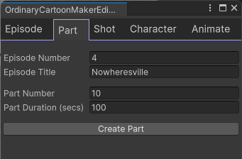

# Ordinary Cartoon Maker


This repository holds code for a Unity Editor Window for use with the
[Unity Sequences](https://docs.unity3d.com/Packages/com.unity.sequences@2.1/manual/index.html)
package. This is a tool I use to create a cartoon series on YouTube,
designed for my personal specific needs. If you don't like the way I have set
up my projects, you may still find this package useful as sample code for
creating your own helper tools for manipulating Sequences, Timelines,
Animation Tracks, etc. It uses UI Toolkit for the UI.

I use Unity as a rendering engine for 3D models, locations, lighting, and
special effects  using Unity Timelines, capturing the output in
video files. Think of cutscenes in a game. I work in Editor mode
to assemble Timelines. This tool is an additional editor window with a
few common operations I perform to speed my work up. Full cartoon creation
is still a lot of additional work beyond this tool.

Here is a sample shot from [episode 1](https://youtu.be/4DDU01Kg9Lw).


Please note: The Sequences 2.1 API removed a few fields I needed access to
from a previous version of the API so this code uses Reflection to sneak
under the covers to get access to what I need (with some help from 
[Ellka](https://forum.unity.com/members/ellka.3283484/) from Unity!)
The Sequences API is planned to change again in the future, but this works
until then.

## Project structure organization

I create animated cartoons using Unity Sequences organized into a hierarchy of
episode/part/shot.  Parts are to help group shots logically within an episode.
I create a new Unity project per location as when I included everything in one
project, Unity slowed down too much (I have big location assets, like complete
city scenes, from the Unity asset store). So to create one episode I generate
a series of shot video clip files in multiple Unity projects. Each location 
project has a Unity scene per episode, if that location appears in that episode.

In each location project I create a `Assets/_LOCAL` directory under which I put
my own files related to that location to keep them separated from assets I
import from the asset store etc. (I only need to back up the `_LOCAL`
directory.) I also have a shared `Assets/_SHARED` package that contains assets
I use across multiple location projects, such as character models, 
animation clips, and general C# scripts.

Each shot typically creates a single video file of a few seconds long.
I then use video editing software to join the different video clip files.
To keep things organized, each video clip file has a filename of the form
`ep1-10-100` (episode number, part number, shot number). Using this numbering
scheme makes it easy to gather and sort all the video clips by filename
for composing the final video file.
Sometimes I break the rule and create multiple video clips from
a single Sequence, but normally I create a new sequence per shot so I can
change camera settings per video clip (e.g. to adjust camera depth of field).

The Editor window in this tool can

* Start a new Unity scene for a new episode
* Add parts to the scene (for grouping a series of shots)
* Add shots to scenes with the choice of camera to use
* Add characters to shots creating animation tracks for the characters
* Animate charactesr in shots, including dialog captions (I don't use real voice tracks... yet)

## Sequences

The Unity Sequences package makes it easier to create a hierarchy of Timeline
objects. This tool assumes the hierarchy of Timelines is 

* Episode Unity Scene and Master Timeline is created per episode with a name of the form "Episode {episodeNumber} - {episodeTitle}" (e.g. "Episode 1 - Outsider").
* Part sub-sequence Timelines are created per part (used to logically group shots) with a name for the form "NN" (e.g. "10", "20", etc.)
* Shot sub-sub-sequence Timelines are created per shot with a name of the form "NNN" (e.g. 010, 020, 030, 100, 110, etc)

I typically use part numbers of 10, 20, 30 etc to make it easier to insert a
new part between existing parts without renumbering the existing parts.
E.g. I may add part 15 between parts 10 and 20.
Similarly I use shot numbers of 010, 020, 030, etc to make it easier to insert
new shots. Episodes for me are typically 5 minutes (300 seconds) or less where
each shot is around 3 seconds resulting in around 100 shots per episode.

Under shot sequences I drop in camera and character game objects (and other
props as required). I don't use the Unity Sequence Assembly support as it
relies on the use of prefab variants for each animation of each character. I
find this inconvenient as each character ends up with a flat list of variants,
one per shot. This becomes unwieldy for projects, and it is hard to line up
animations sequences across tracks when there are multiple characters in a
shot. Long story short, I use Sequences to manage the 3 levels of sequence
Timelines, then I drop Animation Tracks and characters directly under the 3rd
level of sequence in the scene hierarcy.

## The Ordinary Cartoon Maker Window

Opening "Window / Ordinary Cartoon Maker" opens a new window with multiple
tabs. You normally work left to right across the tabs.

### Episode


To start a new Scene, enter the episode number and title. Select a template for
default objects to add to a scene (for example, you might have a HDRP global
profile you use at the scene level for all scenes). The frame rate can also be
specified here (I typically use 24 frames per second, the standard rate for
film).

Create scene templates by creating a scene in the one of the directories
* `Assets/Ordinary Cartoon Maker/Templates/Scenes`,
* `Assets/_SHARED/Ordinary Cartoon Maker/Templates/Scenes`, or
* `Assets/_LOCAL/Ordinary Cartoon Maker/Templates/Scenes`.

The "Create Epsiode" button then creates an episode scene file such as
`Assets/_LOCAL/Episodes/Episode 1 - Outsider/Episode 1 - Outsider.unity`.
An empty "master" sequence is then created in the scene. 

After the scene is created, you can write a screenplay in a particular
format (I do it as a Google doc) and paste the text into the "Screenplay"
text input area then click "Populate Episode From Screenplay". 
This will create Sequences for all the shots in the screenplay,
add the requested main and Cinemachine cameras, add the requested
characters, and animation clips for the characters. These will all
require manual editing afterwards, but I find it useful to speed
up the creation of a new scene.

The supported syntax for screenplays is described below.

### Part



Enter the part number and a rough duration (I take the number of expected shots
and multiply by 10 assuming 10 seconds per shot) to create a "part"
sub-sequence under the master sequence in the scene.

### Shot


Enter the shot number, recording type (movie file or a single still frame that
I sometimes use between parts), camera type, main camera, and Cinemachine camera
to create a new shot sub-sub-sequence under a part sub-sequence.
You can also optionally provide values for a light to add to a scene (typically
the sun), what cloud mode to use, and wind characteristics.

The recording type is used to create a Unity Recorder track for a movie file (I
use WebM as the Recorder video file format as I get better quality files than
when using MP4).

The main camera and Cinemachine cameras are created separately as you can
add many Cinemachine cameras to a shot, but there is only ever one main camera.
The different prefabs are for different main camera settings (e.g. different depth
of field settings or HDRP settings).

### Character


With a shot selected, select a character, typipcally at a specific location
with a default animation clip (e.g. Sam, in the classroom, with a sitting
animation clip at his desk). The character prefab is added under the shot
sequence, an animation track is created, override tracks are added if hand
animation clips/poses are included, etc.

To provide the information to create the animation track prefabs with a
"Character Instructions" component added are stored under
`Assets/_LOCAL/Ordinary Cartoon Maker/Templates/Characters`. For nested menu
items, insert " % " (a percent character with one space either side).
This allows better nesting of all the characters.

`Assets/_SHARED/Ordinary Cartool Maker/Templates/Characters/Hank % Classroom % Sitting.prefab`
for example could be a `CharacterInstructions` instance which holds a
clip referene and the performance seed (typically 1).

### Animate


With a character selected in the scene hierarchy or by selecting the animation
track for the character, enter the values you wish to add to (e.g., body clips
for the Body, Upper Body, Head, Face, Left Hand, Right Hand, or a generic script.
You can also enter dialog, which controls the face to do an approximate lip-sync.
A track is added to display the captions bubbles. 

You can also record a animation clip via the VMC protocol (I use the VSeeFace
app to generate VMC data via a webcam and UltraLeap camera). You click the
`Start Receiving VMC Packets` button first, then `Record` / `Stop Recording`
buttons will appear. The recorded animation clip will be added as a new
override track to the animation track for the character.

## Screenplay

Screenplays must be formatted in a particular way to be processed by
the "Ordinary Script Formatter". The supported formatting is as follows:

* All text up to the first line starting with "EXT." or "INT." is ignored
* `#` through `####` can be used for section breaks.
* `[n-nn-nnn]` holds a shot number code (episode, part, and shot number). After the reference at the start of a line, additional instructions can be written before filming.
* `{directive}` is used to capture a directive on how add cameras and characters to a shot.
* `-Name-` is used to identify the speaker
* `(text)` - captures the mood or speaking style of the speaker. `(thinking)` is used to change the closed caption tex.
* Lines after a `-Name-` up until the next shot are assumed to be dialog. Before the `-Name-` are ignored as action instructions.

More formally, the grammar of screenplay is:

```
screenplay = other-line* (
    section-divider other-line*
    | shot-id-line other-line* directive-line* other-line* (
        speaker-line speaker-mood-line? dialog-line*
    )*
)*

section-divider = heading-line | location-line | music-line

heading-line = "#" text

location-line = ("INT."|"EXT.") text

music-line = "MUSIC:" text

shot-id-line = "[" episode-number "-" part-number "-" shot-number "]" text
episode-number = digit+
part-number = digit+
shot-number = digit+

directive-line = "{" target arg* "}"
target = word
arg = arg-name ":" arg-value
arg-name = word
arg-value = word   (maybe extend to quoted text in future)

speaker-line = "-" speaker-name "-"
speaker-name = text

speaker-mood-line = "(" mood ")"
mood = text

dialog-line = text

other-line = text
```

Directives are:

* `{shot ...}` - one per shot to set the main camera and shot settings
  * Example: `{shot camera:65mm wind:gusty}`
  * `camera` is the main camera prefab to use (defaults to `16mm`)
  * `light` is an optional lighting prefab to add a light (like the sun)
  * `wind` is a prefab for a wind zone
  * `cloud` is a name name of the volumetrics simple cloud type to use ("cloudy" etc)
* `{cm ...}` - adds a Cinemachine camera to the scene
  * Example: `{cm lookAt:Hank from:Behind}`
  * Example: `{cm lookAt:Hank sitting frame:Closeup}`
  * Example: `{cm lookAt:Hank follow:Sam from:BehindLeftShoulder}`
  * `camera` is the camera prefab to use
  * `look` specifies a direction (North/South/East/West).
  * `sitting` adjusts the height of a lookAt target lower
  * `lookAt` specifies the character to look at
  * `follow` turns on Cinemachine following of a character
  * `from` specifies the follow offset (Front, Behind, Left, Right, BehindLeftShoulder, BehindRightShoulder)
  * `frame` controls how close the camera is to the character (Closeup, Mid, Wide)
* `{Sam/Classroom/Sitting ...}` - add a character with an initial location and animation clip to the shot
  * Example: `{Hank/OutsideClassroom/Walking look:Down lh:Fist rh:Fist face:Angry clip:HankHoldingBag,BagOn}`
  * Example: `{Hank/Classroom/Sitting face:Angry rotate:180 lookAt:Sam}`
  * `body` adds a Body animation clip
  * `upper` adds an Upper Body animation clip (with avatar mask)
  * `head` adds a Head animation clip (with avatar mask)
  * `face` adds a Face animation clip
  * `lh` adds a Left Hand animation clip (with avatar mask)
  * `rh` adds a Right Hand animation clip (with avatar mask)
  * `clip` adds a Generic animation clip in a new track
  * `look` turns the characters head Up, Down, Left, Right
  * `lookAt` makes the character track looking at another character
  * `rotate` rotates the character the specified angle (e.g. 180)

There is also an extension to pretty print a Google document using the above markup.


## Other

I blog at https://extra-ordinary.tv/blog.

